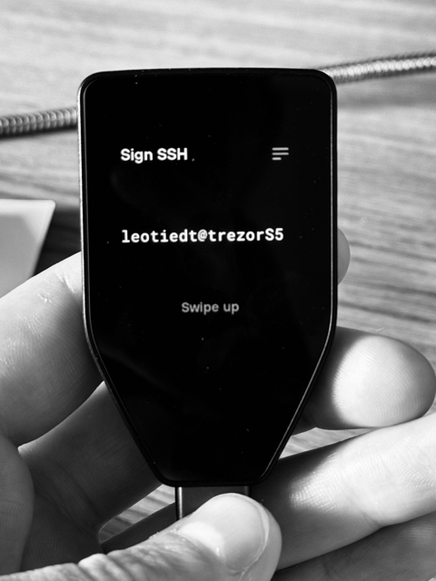

# Using Trezor Hardware Wallet as a hardware SSH key on Mac OSX

> **Disclaimer**: I am not sponsored by Trezor / SatoshiLabs. I bought a Trezor recently, and was disappointed by the lack of official information regarding the SSH support and using Trezor's SSH support on macOS. After piecing some information together from around the web, I managed to get SSH support working decently on macOS, and figured I would save people a lot of time by explaining everything in one singular article.

> I did not invent nor do I / have I ever developed Trezor's products. I am not involved in developing trezor-agent or its dependencies. If bad things happen to you as a result of following this article, whether loss of coins, loss of data, or getting locked out of your server(s) - I am not responsible.

> This is basically a copy of a guide from "peakd.com" written by "someguy123". I just experienced some problems with his guide that are fixed in this one. You can find the original guide here: https://peakd.com/security/@someguy123/using-trezor-hardware-wallet-as-a-hardware-ssh-key-on-mac-osx 


## Trezor SSH Authentication Support

This guide covers how to use Trezor’s SSH authentication support with macOS. It allows you to generate an Ed25519 SSH key on your Trezor and use it to log into servers with effective SSH 2FA through authorizing SSH logins using your Trezor screen/buttons.

## Requirements

1. A Trezor hardware wallet that is set up, unlocked, and plugged into your Mac.
2. A Mac running the latest OS.
3. Basic experience working with the macOS terminal.

## Install and configure Trezor SSH Agent

You'll need the packages `libusb` (for communicating with Trezor) and `trezor-agent` (an SSH key agent).

### Installing trezor-agent

Use Homebrew to install the required packages:

```bash
brew install libusb
brew install trezor-agent
```

In case some resources become unavailable in the future, I stored a backup of both in the `/static/libs` folder. (28.09.24)

- libusb - https://github.com/libusb/libusb
- trezor-agent - https://github.com/romanz/trezor-agent

### Generating an SSH key

To generate a key using the `trezor-agent`:

```bash
trezor-agent -e ed25519 leotiedt@trezorS5 >> ~/.ssh/trezor.conf
```

IMPORTANT: Please note that the private key will also be derieved from your set `leotiedt@trezorS5`. When you loose your Trezor you need to put in the exact same `leotiedt@trezorS5` to 'activate' the private key on your new trezor again!

Check the generated key:

```bash
cat ~/.ssh/trezor.conf
#Output: ssh-ed25519 AAAAC3NzaC1lZDI1NTE5AAAAIOG2oSQjhNdLu69Tveqrses8VAoaqwYdB81eypWQE9D <ssh://leotiedt@trezorS5|ed25519>
```

### Running trezor-agent as a background service

Create a folder to house the UNIX socket file for `trezor-agent`:

```bash
mkdir -p ~/.ssh/trezor-agent
```

Download the plist file and register it as a background service:

```bash
wget -O ~/Library/LaunchAgents/trezor.ssh.socket.plist https://cdn.privex.io/extras/configs/trezor.ssh.socket.plist
launchctl load ~/Library/LaunchAgents/trezor.ssh.socket.plist
launchctl start "Trezor SSH Socket"
```

In case the `.plist` file becomes unavailable it's also stored in this repo: `/static/files/trezor.ssh.socket.plist`

Check if `Trezor SSH Socket` started successfully using:
```bash
launchctl list | grep -i trezor
# OUTPUT
#leotiedt@MBP-von-Leo-2 ~ % launchctl list | grep -i trezor
#-	0	io.trezor.TrezorSuite.ShipIt
#97189	127	Trezor SSH Socket
```
Check `error.log` in case you dont see any process id (in this case: `97189`). In some cases `trezor-agent` is not installed in `/usr/local/bin/trezor-agent` but  `/opt/homebrew/bin/trezor-agent`. You'll need to create a Symlink then using:
```bash
sudo ln -s /opt/homebrew/bin/trezor-agent /usr/local/bin/trezor-agent
#enter your password to confirm the linkage
```

### Using your Trezor SSH key(s)

Copy your SSH public key to remote servers/devices.

On your local machine:

```bash
nano ~/.ssh/trezor.conf #copy your created ssh public key e.g.: ssh-ed25519 AAAAC3NzaC1lZDI1NTE5AAAAIOG2oSQjhNdLu69Tveqrses8VAoaqwYdB81eypWQE9D <ssh://leotiedt@trezorS5|ed25519>
```

On your server machine:

```bash
nano ~/.ssh/authorized_keys #access this folder and paste your public key
# reboot your machine
# after a successfull login disable password auth on your server.
```

### Add the ssh-trez function to your shell configuration

Add the `ssh-trez` function to your `~/.bashrc` or `~/.zshrc` (`~/.zshrc` in case your using MacOS):

```bash
BOLD="" GREEN="" YELLOW="" RESET=""
if [ -t 1 ]; then
    BOLD="$(tput bold)" GREEN="$(tput setaf 2)" YELLOW="$(tput setaf 3)" RESET="$(tput sgr0)"
fi

ssh-trez() {
    >&2 echo -e "${BOLD}${GREEN} [...] Connecting to SSH using parameters:${RESET} $*"
    >&2 echo -e "${YELLOW} [...] Please remember to CONFIRM the login on your Trezor!${RESET}"
    ssh -o 'IdentityAgent ~/.ssh/trezor-agent/S.ssh' "$@"
}
```

Initialise the change using `source ~/.zshrc` or `source ~/.bashrc`.

Now you're ready to connect to your server using `ssh-trez root@1.2.3.4` in your terminal


## OPTIONAL #1 (not recommended) Configuring SSH to always use Trezor for specific hosts

Please note that if your're using 1Password or another SSH-Key host file in your `~/.ssh/config` you'll most likely get into problem unless you do not define every server using its specific host file like following. I highly recommend to just use `ssh-trez root@1.2.3.4` for connecting...

This is how you would need to define every other server in case you decide to go the extra mile:

Edit `~/.ssh/config`:

```bash
nano ~/.ssh/config
```

Add the following lines:

```bash
Host someguy-bsd
    Hostname 178.128.170.247
    User root
    Port 22
    IdentityAgent ~/.ssh/trezor-agent/S.ssh
```

## Connecting to an SSH host

Using the `ssh-trez` function:

```bash
ssh-trez root@1.2.3.4
```

Or, using the alias in `~/.ssh/config`:

```bash
ssh someguy-bsd
```

When connecting you'll be prompted to enter your Trezor PIN and (if set up) your passphrase:





References:
https://peakd.com/security/@someguy123/using-trezor-hardware-wallet-as-a-hardware-ssh-key-on-mac-osx
